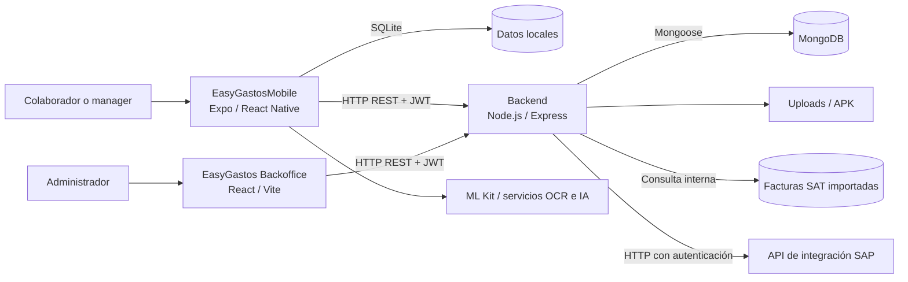
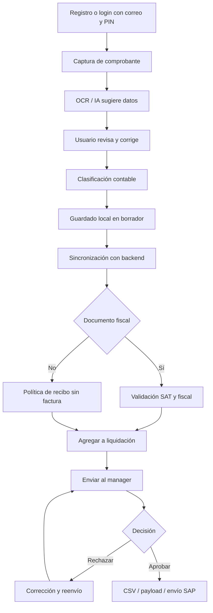

# EasyGastos

Documentación general funcional, técnica y operativa de **EasyGastos**, una solución para registrar gastos empresariales desde dispositivos móviles, conservar su evidencia, validar información fiscal, agrupar gastos en liquidaciones, someterlos a aprobación y preparar o enviar la información contable hacia SAP.

Este repositorio reúne la aplicación móvil **EasyGastosMobile**, la API **EasyGastos Backend** y el portal administrativo **EasyGastos Backoffice**, además de especificaciones funcionales, planes de implementación, colecciones de prueba y documentación de soporte.

> **Alcance del documento:** describe el comportamiento observado en el código y la documentación disponible al 23 de julio de 2026. Algunos archivos de `documentacion/` y `plans/` representan acuerdos, objetivos de MVP o bitácoras históricas y no necesariamente una función terminada. Ante diferencias, el código desplegado, la configuración del ambiente y las reglas vigentes de negocio son la fuente operativa definitiva.

## Contenido

- [Propósito y alcance funcional](#propósito-y-alcance-funcional)
- [Componentes de la solución](#componentes-de-la-solución)
- [Arquitectura](#arquitectura)
- [Usuarios y responsabilidades](#usuarios-y-responsabilidades)
- [Flujo funcional de punta a punta](#flujo-funcional-de-punta-a-punta)
- [Dominios y módulos funcionales](#dominios-y-módulos-funcionales)
- [Reglas funcionales principales](#reglas-funcionales-principales)
- [Estado y límites del alcance](#estado-y-límites-del-alcance)
- [Tecnologías](#tecnologías)
- [Aplicación móvil](#aplicación-móvil)
- [Backend y API](#backend-y-api)
- [Backoffice](#backoffice)
- [Datos y persistencia](#datos-y-persistencia)
- [Seguridad y acceso](#seguridad-y-acceso)
- [Configuración de ambientes](#configuración-de-ambientes)
- [Instalación y ejecución](#instalación-y-ejecución)
- [Cómo interactuar con la solución](#cómo-interactuar-con-la-solución)
- [Pruebas y validación](#pruebas-y-validación)
- [Compilación y despliegue](#compilación-y-despliegue)
- [Estructura del repositorio](#estructura-del-repositorio)
- [Documentación complementaria](#documentación-complementaria)
- [Riesgos, deuda técnica y recomendaciones](#riesgos-deuda-técnica-y-recomendaciones)
- [Glosario](#glosario)

## Propósito y alcance funcional

EasyGastos digitaliza el ciclo de caja chica y liquidación de gastos. El colaborador captura un comprobante, completa o corrige sus datos, clasifica el gasto con información contable y lo conserva localmente. Después puede sincronizarlo con el backend, incorporarlo a una liquidación y enviarlo a su manager. El manager revisa la evidencia y decide si aprueba o rechaza. Para documentos fiscales, el sistema también conserva el estado de validación SAT y la elegibilidad fiscal. Las liquidaciones aprobadas pueden exportarse o enviarse a la integración SAP configurada.

Los objetivos principales son:

- Registrar gastos con imagen o documento de respaldo.
- Reducir la captura manual mediante escaneo, OCR y extracción asistida por IA.
- Mantener al usuario como responsable final de los campos críticos.
- Clasificar gastos con sociedad, centro, cuenta contable, orden CO y categoría.
- Trabajar con datos locales en el dispositivo y sincronizarlos con el servidor.
- Validar facturas contra información SAT cargada internamente.
- Controlar vigencia, NIT receptor y otros criterios de elegibilidad fiscal.
- Agrupar gastos en liquidaciones por sociedad y moneda.
- Enrutar liquidaciones al manager directo.
- Aprobar, rechazar, corregir y reenviar con trazabilidad.
- Generar CSV, construir el payload contable y transferir liquidaciones hacia SAP.
- Administrar catálogos maestros y parámetros sin modificar la aplicación móvil.

## Componentes de la solución

| Componente | Carpeta canónica | Responsabilidad | Usuarios principales |
|---|---|---|---|
| EasyGastosMobile | `EasyGastosMobile/` | Captura de gastos, OCR, consulta, categorías, liquidaciones, aprobación, sincronización y configuración del dispositivo | Colaboradores y managers |
| EasyGastos Backend | `EasyGastosMobile/backend/` | API REST, JWT, reglas de negocio, MongoDB, archivos, SAT interno, sincronización, aprobación e integración SAP | App móvil y backoffice |
| EasyGastos Backoffice | `EasyGastosBackoffice/` | Administración de sociedades, centros, cuentas, órdenes CO y vigencia fiscal | Administradores |
| Documentación funcional | `documentacion/` | Requerimientos, contratos MVP, evidencia de reuniones, ejemplos SAP/SAT y guías de validación | Negocio, soporte, QA y desarrollo |
| Planificación y bitácoras | `plans/` | Roadmap, acuerdos por hito, decisiones, suspensiones y despliegues manuales | Equipo del proyecto |
| Pruebas móviles declarativas | `pruebas unitarias/` | Escenarios YAML de lanzamiento, registro y selección de sociedad | QA móvil |

Los componentes no comparten un único proceso de instalación o compilación. Cada aplicación conserva su propio `package.json` y `package-lock.json`.

Existe una copia de `EasyGastosBackoffice/` dentro de `EasyGastosMobile/EasyGastosBackoffice/`. Los archivos principales comparados son idénticos al momento de esta revisión. Para evitar divergencias, este documento considera `EasyGastosBackoffice/` en la raíz como la copia canónica y recomienda eliminar o automatizar la sincronización de la copia anidada después de confirmar el flujo de despliegue.

## Arquitectura



### Flujo técnico general

1. La app registra o autentica al usuario mediante correo y PIN.
2. El backend devuelve un JWT con vigencia de 48 horas y los datos del perfil.
3. La app inicializa SQLite y conserva localmente usuario, configuración, categorías, gastos, liquidaciones, catálogos e historial de chat.
4. Las operaciones locales se marcan para sincronización.
5. `BackendSyncService` sube cambios y descarga el estado consolidado del servidor.
6. El backend valida identidad, permisos, estados, reglas fiscales y relaciones manager–empleado.
7. MongoDB conserva la versión compartida de los registros.
8. El backoffice mantiene los catálogos maestros que la app descarga y cachea.
9. Cuando una liquidación cumple las reglas, puede generar CSV, mostrar una vista previa del payload SAP o enviarse al endpoint de integración.

## Usuarios y responsabilidades

| Rol | Capacidades observadas |
|---|---|
| Colaborador | Registrarse, iniciar sesión, cambiar PIN, capturar y editar gastos, administrar sus categorías, crear liquidaciones, asociar gastos, enviar a aprobación, corregir borradores rechazados y consultar su información |
| Manager | Capacidades de colaborador más consulta de empleados asociados, gastos o liquidaciones pendientes y aprobación o rechazo |
| Administrador | Acceso al backoffice para mantener sociedades, centros, cuentas, órdenes CO y el parámetro de vigencia de factura |

Los permisos del backend se apoyan en los campos `isManager` e `isAdmin` del usuario y en las relaciones de `manager_employee_links`. La autorización efectiva debe verificarse siempre en la API; ocultar una opción en la interfaz no constituye control de acceso.

## Flujo funcional de punta a punta



### 1. Registro, autenticación y sesión

- El registro solicita identidad básica, código de empleado, sociedad, correo y PIN numérico de cuatro dígitos.
- El login usa correo y PIN.
- El backend emite un JWT válido por 48 horas.
- La app dispone de una pantalla de desbloqueo y recuperación/cambio de PIN.
- La sesión y los datos necesarios para operar se conservan localmente.

### 2. Captura y clasificación del gasto

- El usuario puede tomar o seleccionar evidencia.
- La app incluye reconocimiento de texto con ML Kit, manipulación de imagen y servicios de extracción externos.
- Los datos detectados pueden completar fecha, monto, proveedor, NIT, serie, número, UUID y otros campos.
- El usuario puede corregir la extracción antes de guardar.
- El gasto se relaciona con categoría, sociedad, centro, cuenta y orden CO.
- La imagen puede subirse al backend y quedar referenciada desde el gasto.

### 3. Validación fiscal

- La solución consulta una colección interna de facturas SAT importadas desde archivos Excel.
- El resultado SAT se conserva en el gasto junto con fecha, fuente, huella y snapshot fiscal.
- La elegibilidad fiscal distingue pendientes, aptos, bloqueo por NIT de sociedad y bloqueo por antigüedad.
- Si cambian datos fiscales relevantes, la validación previa deja de ser confiable y debe recalcularse.

### 4. Liquidación

- El usuario selecciona gastos elegibles y define sociedad y moneda.
- La liquidación mantiene sus gastos, total, creador, manager y estado.
- Antes del envío se vuelven a evaluar integridad, asociación y reglas fiscales.
- Una liquidación bloqueada conserva la razón y el detalle de gastos que causaron el bloqueo.

### 5. Aprobación

- El manager consulta liquidaciones enviadas por empleados vinculados.
- Solo una liquidación en estado enviado puede aprobarse o rechazarse.
- El rechazo conserva actor, fecha y comentario.
- El colaborador puede devolver el caso a borrador, corregirlo y reenviarlo según las reglas vigentes.
- La app ejecuta una actualización periódica para el flujo de manager.

### 6. Salida SAP

- El backend puede generar un CSV de la liquidación.
- Existe un endpoint de vista previa del payload SAP.
- Existe un endpoint de envío hacia `SAP_EA_DOCUMENT_URL` con autenticación configurada por ambiente.
- La liquidación conserva estado, referencia, mensaje y fecha de sincronización SAP.

La documentación original del MVP definía inicialmente una exportación estructurada y carga manual. El endpoint de envío directo observado es una evolución posterior. Su disponibilidad productiva depende de credenciales, red, contrato vigente y validación integral con SAP.

## Dominios y módulos funcionales

### Gastos y evidencia

- Alta y edición de gastos.
- Foto, escaneo o selección de documento.
- Almacenamiento y consulta de la evidencia.
- Campos de factura FEL y datos generales del gasto.
- Borrador, asociación a liquidación, aprobación y anulación lógica.
- Detección de factura duplicada.
- Notas, comentarios de aprobación y motivo de anulación.
- Estadísticas por usuario.

### OCR, IA y asistencia conversacional

- OCR local mediante ML Kit.
- Procesamiento y manipulación de imágenes.
- Extracción mediante servicios externos configurados en los servicios móviles.
- Método tradicional de respaldo cuando el servicio de IA no está disponible.
- Chat de asistencia para gastos.
- Historial local de conversaciones y sincronización por lotes con el backend.

### Catálogos contables

- Sociedades y NIT oficiales.
- Centros de costo y propietario.
- Cuentas contables.
- Órdenes CO.
- Categorías personales que combinan sociedad, centro, cuenta y orden CO.
- Activación, desactivación, versionado y sincronización local.
- Conservación del snapshot contable en gastos ya capturados.

### SAT y elegibilidad fiscal

- Importación de archivos SAT.
- Registro de archivos procesados para evitar reprocesos.
- Consulta de facturas y estadísticas.
- Búsqueda por autorización, serie, número, emisor y receptor.
- Validación SAT interna.
- Validación del NIT receptor contra la sociedad.
- Vigencia máxima parametrizable de facturas.
- Huellas fiscales para detectar cambios posteriores.

### Liquidaciones

- Creación a partir de uno o varios gastos.
- Consulta por colaborador y manager.
- Asociación y desasociación controlada de gastos.
- Envío, aprobación, rechazo, retorno a borrador y eliminación de borradores.
- Bloqueo fiscal con detalle.
- Generación de CSV.
- Vista previa y envío SAP.

### Organización y aprobación

- Perfil de usuario con departamento, sociedad y manager.
- Relaciones explícitas manager–empleado.
- Consulta por empleado, manager o departamento.
- Asignación individual y masiva.
- Validación de acceso a datos propios o de colaboradores vinculados.

### Sincronización y operación offline

- Persistencia local en SQLite.
- Marcadores `needsSync`, `synced` y `lastSync`.
- Carga y descarga de usuarios, categorías, gastos y liquidaciones.
- Registro de logs y consulta de estado de sincronización.
- Descarga diferenciada de pendientes para managers.
- Reintento desde servicios móviles ante errores de red.

### Actualización de la app

- Consulta de versión disponible.
- Descarga de APK publicado por el backend.
- Registro/actualización de metadatos de versión.
- Carpeta controlada para APK bajo `backend/apks/`.

### Administración web

- Login con el mismo correo, PIN y JWT de EasyGastos.
- Ruta protegida para usuarios con `isAdmin`.
- CRUD y cambio de estado de sociedades, centros, cuentas y órdenes CO.
- Consulta y edición del parámetro de vigencia de factura.

## Reglas funcionales principales

### Calidad OCR y corrección manual

- El OCR asiste; no reemplaza la revisión del usuario.
- La descripción final permanece bajo control del usuario.
- Los campos críticos son monto, fecha, NIT, serie y número.
- Los valores de baja confianza deben conservarse como referencia y requerir captura manual antes de liquidar.
- Se puede guardar un borrador incompleto, pero no enviarlo si incumple los mínimos.

### Campos mínimos por tipo documental

| Tipo | Campos mínimos documentados |
|---|---|
| Factura fiscal | Fecha de emisión, monto, proveedor/NIT, serie, número y categoría contable |
| Recibo sin factura | Fecha, monto, proveedor o beneficiario, categoría y justificación |

Para un recibo sin factura, serie y número no son obligatorios. Si no existe NIT, la especificación exige una justificación específica de identificación faltante.

### Recibos sin factura

- Requieren justificación.
- Requieren revisión manual explícita del manager.
- La especificación funcional define un tope global inicial de **GTQ 300.00**, editable por configuración.
- Un monto superior al tope debe bloquear el envío.
- En el MVP se permiten todas las categorías contables válidas.

Esta política está claramente documentada como regla objetivo. Antes de considerarla control productivo debe verificarse la aplicación efectiva del parámetro en móvil y backend mediante los casos de aceptación definidos.

### Estados

Los nombres funcionales y los valores técnicos no son idénticos en todos los componentes.

| Dominio | Valores técnicos observados |
|---|---|
| Gasto operativo | `BORRADOR` y otros valores tratados por las rutas de estado |
| Estado del gasto | `draft`, `in_liquidation`, `approved`, `voided` |
| SAT | `VALIDADO_SAT`, `PENDIENTE_VALIDACION_SAT` |
| Elegibilidad fiscal | `PENDIENTE`, `APTO_PARA_LIQUIDAR`, `BLOQUEADO_NIT_SOCIEDAD`, `BLOQUEADO_ANTIGUEDAD` |
| Liquidación | `draft`, `submitted`, `approved`, `rejected`, `fiscal_blocked` |

La documentación funcional utiliza además los nombres Borrador, BorradorRechazado, Enviada, Aprobada y Rechazada. Al integrar o reportar datos, use los valores exactos aceptados por el endpoint correspondiente.

### Trazabilidad

- Los modelos MongoDB usan `createdAt` y `updatedAt`.
- Gastos y liquidaciones conservan responsables y fechas de aprobación o rechazo.
- La sincronización registra entidad, acción, éxito y error.
- SAT conserva fuente, fecha, huella y snapshot.
- SAP conserva referencia, estado, mensaje y fecha.

## Estado y límites del alcance

### Capacidades observadas en código

- Aplicación Android con rutas funcionales para gastos, categorías, liquidaciones, manager y configuración.
- Persistencia local SQLite y sincronización con backend.
- API Express conectada a MongoDB.
- Autenticación JWT y controles para manager/administrador en middleware.
- Carga y consulta interna de facturas SAT.
- Validaciones fiscales y migraciones MVP2 EP-01.
- Backoffice de catálogos y parámetro de vigencia.
- Generación de CSV, preview de payload y envío SAP.
- Pruebas automatizadas de contratos, modelos, catálogos, middleware y backoffice.

### Elementos que requieren confirmación de negocio o ambiente

- Resultado formal del checklist Go/No-Go del MVP.
- Cobertura real de todos los criterios OCR con facturas de baja calidad.
- Aplicación completa de la política de recibos sin factura.
- Comportamiento offline, idempotencia y resolución de conflictos bajo concurrencia real.
- Contrato y credenciales vigentes del endpoint SAP.
- Pruebas de punta a punta con SAT, manager y SAP en QA.
- Soporte iOS: Expo contiene configuración iOS, pero el repositorio no incluye proyecto nativo `ios/` y la documentación del MVP lo ubica como fase posterior.

## Tecnologías

### EasyGastosMobile

- Expo `~53.0.27`.
- React Native `0.79.6` y React `19.0.0`.
- TypeScript y Expo Router `~5.1.11`.
- React Navigation 7.
- Expo SQLite y AsyncStorage.
- Expo Secure Store, File System, Notifications, Sharing y Document Picker.
- Expo Image, Image Picker e Image Manipulator.
- ML Kit Text Recognition.
- Escáner de documentos nativo.
- Android nativo con Gradle y Kotlin.

### Backend

- Node.js y CommonJS.
- Express `4.18.2`.
- MongoDB y Mongoose `8`.
- JWT `9` y bcrypt.
- Helmet, CORS, Morgan y rate limiting.
- Multer para archivos.
- XLSX para importación SAT.
- `node:test` para pruebas.
- PM2 para ejecución en servidor.

### Backoffice

- React `18.3`.
- TypeScript `5.7`.
- Vite `5.4`.
- React Router `6.30`.
- Vitest y Testing Library.
- Playwright para recorridos E2E.

### Infraestructura observada

- Backend HTTP en puerto `3000` de forma predeterminada.
- MongoDB local o remoto mediante `MONGODB_URI`.
- Backend desplegable en Linux/EC2 con PM2.
- App móvil configurada actualmente contra una dirección HTTP predeterminada y editable desde el dispositivo.
- Backoffice configurable mediante `VITE_API_URL`.
- Integración SAP por endpoint HTTP externo.
- No se observan Dockerfile, Docker Compose ni pipeline CI/CD en el repositorio.

## Aplicación móvil

### Navegación principal

| Ruta | Función |
|---|---|
| `setup` | Registro/configuración inicial |
| `unlock` | Desbloqueo, login operativo y cambio de PIN |
| `dashboard` | Resumen y accesos rápidos |
| `expenses` | Lista, búsqueda, selección y creación de liquidación |
| `add-expense` | Captura, OCR, validación y guardado |
| `expense-detail` | Consulta y edición del gasto |
| `liquidations` | Lista de liquidaciones propias o pendientes |
| `liquidation-detail` | Detalle, envío, exportación y acciones SAP |
| `manager-approval` | Revisión y decisión del manager |
| `categories` | Categorías personales y combinación contable |
| `expense-chat` / `chat-history` | Asistente e historial |
| `settings` | Perfil, PIN, sincronización y preferencias |
| `backend-config` | URL del backend y configuración de servicios OCR |

### Servicios principales

| Servicio | Responsabilidad |
|---|---|
| `AuthService` | Usuario local, PIN y sesión |
| `ExpenseService` | SQLite y reglas de gastos |
| `LiquidationService` | SQLite y ciclo de liquidaciones |
| `CategoryService` | Categorías personales |
| `AccountingCatalogService` | Catálogos maestros versionados |
| `BackendSyncService` | Registro, login y sincronización integral |
| `SATFacturaService` | Consulta SAT interna |
| `ExpenseFiscalValidationService` | Evaluación fiscal del gasto |
| `AIExtractionService` / `OCRUtils` | Extracción asistida |
| `ChatHistoryService` / `ChatHistorySyncService` | Historial conversacional |
| `ExportService` | Exportación y compartición |
| `UpdateService` | Versiones y APK |
| `SettingsService` | Configuración local |

### Persistencia local

La app abre `easygastos.db` y crea o evoluciona tablas para:

- usuario y configuración;
- categorías;
- gastos;
- liquidaciones;
- catálogos contables y metadatos de versión;
- conversaciones de chat.

Las migraciones locales se realizan principalmente mediante `CREATE TABLE IF NOT EXISTS` y `ALTER TABLE` dentro de los servicios. No existe un framework centralizado de migraciones SQLite; cualquier cambio de modelo debe probar actualización desde versiones anteriores, no solo instalación limpia.

## Backend y API

### Organización

| Ruta | Contenido |
|---|---|
| `server.js` | Bootstrap de Express, seguridad, rutas, archivos y conexión |
| `database/init.js` | Conexión MongoDB y esquemas principales |
| `routes/` | Recursos REST |
| `middleware/auth.js` | JWT, manager, administrador y acceso delegado |
| `models/` | Modelos SAT y catálogos maestros |
| `services/` | Reglas fiscales, catálogos y payload SAP |
| `contracts/` | Contratos de validación fiscal |
| `migrations/` | Migración versionada de MVP2 EP-01 |
| `scripts/` | Inicialización, importación, diagnóstico y administración |
| `test/` | Pruebas automatizadas |
| `SAT/` | Entrada y documentación del importador SAT |
| `uploads/` | Evidencia cargada |
| `apks/` | Versiones publicables de la app |

### Grupos de endpoints

La API usa JSON y la raíz funcional `/api`. Las rutas protegidas esperan:

```http
Authorization: Bearer <token>
```

| Recurso | Base | Operaciones principales |
|---|---|---|
| Salud | `/health` | Estado de API, MongoDB y tiempo activo |
| Usuarios | `/api/users` | Registro, login, PIN, perfil y listado |
| Categorías | `/api/categories` | CRUD y estadísticas |
| Gastos | `/api/expenses` | Validación fiscal, CRUD parcial, estado, pendientes, aprobación y estadísticas |
| Sincronización | `/api/sync` | Sincronización completa, carga, logs y estado |
| Managers | `/api/manager-links` | Consultas, CRUD y asignación masiva |
| Liquidaciones | `/api/liquidations` | CRUD, gastos, envío, decisión, CSV y SAP |
| Chat | `/api/chat-history` | CRUD, limpieza y sincronización por lotes |
| SAT | `/api/sat` | Importación, archivos, facturas, estadísticas, búsqueda y validación |
| Sociedades | `/api/sociedades` | Consulta por código/NIT y sincronización |
| Catálogos móviles | `/api/catalogs` | Catálogos activos y versión |
| Administración | `/api/admin` | CRUD de maestros y vigencia fiscal |
| Archivos | `/api/uploads` | Carga de evidencia |
| App | `/api/app` | Versión y descarga de APK |

La página `GET /` y `GET /api` devuelve información resumida de la API, pero no sustituye una especificación OpenAPI. Para integrar una operación de escritura, revise la ruta, validadores y servicio correspondientes.

### Colecciones MongoDB

| Colección | Uso |
|---|---|
| `users` | Identidad, PIN, sociedad y roles |
| `categories` | Categorías contables personales |
| `expenses` | Gastos, evidencia, estados y datos fiscales |
| `liquidations` | Agrupaciones, aprobación, bloqueo fiscal y SAP |
| `sync_logs` | Resultado de sincronizaciones |
| `config` | Configuración genérica |
| `chat_conversations` | Historial del asistente |
| `manager_employee_links` | Jerarquía de aprobación |
| `sociedades` | Sociedad, NIT y configuración |
| `centros` | Centros de costo |
| `cuentas` | Cuentas contables |
| `ordenes_co` | Órdenes CO |
| `system_parameters` | Parámetros como vigencia fiscal |
| `sat_facturas` | Facturas SAT normalizadas |
| colección de archivos SAT | Control de importaciones y hashes |

## Backoffice

El backoffice se publica como una SPA y ofrece estas rutas:

| Ruta | Función |
|---|---|
| `/login` | Autenticación con correo y PIN |
| `/sociedades` | Sociedad, NIT, acrónimo y razón social |
| `/centros` | Código, acrónimo y propietario |
| `/cuentas` | Código y acrónimo contable |
| `/ordenes-co` | Código y acrónimo de orden |
| `/vigencia` | Días de validez de una factura |

El frontend valida `isAdmin`, conserva el JWT en almacenamiento web y consume `/api/admin`. La API debe aplicar el mismo control en todas las rutas administrativas.

## Datos y persistencia

### Separación de responsabilidades

- **SQLite** sostiene la operación del dispositivo, la experiencia offline y la cola de cambios.
- **MongoDB** es la fuente compartida entre dispositivos, managers, backoffice y procesos de integración.
- **Archivos del backend** conservan imágenes cargadas y APK, salvo que el ambiente use un almacenamiento externo no incluido en este repositorio.
- **SAT interno** se alimenta mediante archivos Excel importados a MongoDB.

### Identificadores

- Gastos, categorías, liquidaciones y conversaciones mantienen un `id` de aplicación además del `_id` de MongoDB.
- Los gastos pueden guardar `uuid` FEL y el vínculo `satFacturaId`.
- Las operaciones de sincronización deben tratar los identificadores de cliente como claves de idempotencia.

### Cambios de esquema

El backend dispone de scripts dry-run/aplicables para MVP2 EP-01 y catálogos. Deben ejecutarse primero en modo de simulación, con respaldo y en el ambiente correcto:

```powershell
npm run migrate:mvp2-ep01:dry-run
npm run migrate:catalogs:dry-run
```

Solo después de revisar el resultado:

```powershell
npm run migrate:mvp2-ep01:apply
npm run migrate:catalogs:apply
```

## Seguridad y acceso

### Autenticación

Ejemplo de login:

```http
POST /api/users/login
Content-Type: application/json

{
  "email": "usuario@empresa.com",
  "pin": "0000"
}
```

La respuesta incluye token y perfil. El token:

- se firma con `JWT_SECRET`;
- vence en 48 horas;
- identifica al usuario;
- se valida además contra un usuario activo en MongoDB.

### Autorización

- `authenticateToken` exige JWT válido.
- `requireManager` exige `isManager`.
- `requireAdmin` exige `isAdmin`.
- `canAccessUserData` permite datos propios o de un empleado enlazado al manager.

### Consideraciones críticas

- No usar el valor de respaldo de `JWT_SECRET` en ningún ambiente compartido.
- El archivo `.env` contiene secretos y no debe documentarse, enviarse ni confirmarse en control de versiones.
- No registrar PIN, JWT, contraseñas SAP ni payloads completos con datos fiscales.
- El backend acepta todos los orígenes CORS cuando `NODE_ENV=production`; debe reemplazarse por una lista explícita.
- Las rutas de `routes/admin-catalogs.js` están protegidas globalmente con `authenticateToken` y `requireAdmin`; preserve esa protección al agregar recursos.
- Los endpoints de publicación de versión de la app también requieren revisión de autorización.
- La app y ejemplos de despliegue usan HTTP. Producción debe usar HTTPS mediante proxy inverso o balanceador.
- El APK `release` observado se firma con el keystore de depuración. No debe distribuirse como release oficial.
- Las imágenes y datos SAT pueden contener información personal o fiscal; aplique retención, cifrado, respaldos y acceso mínimo.

## Configuración de ambientes

### Backend

Copie la plantilla sin reutilizar valores de ejemplo:

```powershell
cd .\EasyGastosMobile\backend
Copy-Item .env.production.example .env
```

Variables relevantes:

```dotenv
NODE_ENV=development
PORT=3000
BIND_IP=0.0.0.0
MONGODB_URI=mongodb://localhost:27017/easygastos
DATABASE_NAME=easygastos
ALLOWED_ORIGINS=http://localhost:5173,http://localhost:8081
RATE_LIMIT_WINDOW_MS=900000
RATE_LIMIT_MAX_REQUESTS=1000
JWT_SECRET=<secreto-largo-y-aleatorio>
SAP_EA_DOCUMENT_URL=<endpoint-del-ambiente>
SAP_EA_DOCUMENT_USER=<usuario-tecnico>
SAP_EA_DOCUMENT_PASSWORD=<secreto>
```

`DATABASE_NAME` se usa cuando `MONGODB_URI` no incluye una base. No confirme el `.env` real.

### Aplicación móvil

`EasyGastosMobile/config/backend.ts` define una URL predeterminada y permite guardar una URL personalizada en AsyncStorage desde la pantalla de configuración. Para desarrollo:

- Emulador Android hacia el host: normalmente `http://10.0.2.2:3000`.
- Dispositivo físico: URL HTTPS o IP accesible dentro de la misma red/VPN.
- Producción: dominio HTTPS administrado por infraestructura.

Actualmente también existen endpoints externos de OCR/IA definidos en servicios móviles. Deben centralizarse por ambiente y sus API keys deben guardarse con un mecanismo seguro, no en código ni AsyncStorage sin protección.

### Backoffice

Desde `EasyGastosBackoffice/`:

```powershell
Copy-Item .env.example .env.local
```

Contenido esperado:

```dotenv
VITE_API_URL=http://localhost:3000
```

En producción configure el dominio HTTPS del backend. Si frontend y API se publican en dominios distintos, agregue únicamente el origen del backoffice a CORS.

## Instalación y ejecución

### Requisitos previos

- Git o una copia íntegra del repositorio.
- Node.js 18 o superior y npm.
- MongoDB compatible con Mongoose 8.
- Para Android: Android Studio, SDK/NDK requeridos por Expo 53, JDK y un emulador o dispositivo.
- Para iOS: macOS, Xcode y generación previa del proyecto nativo.
- Para pruebas E2E web: Microsoft Edge instalado, según la configuración actual de Playwright.
- Acceso a SAT/SAP únicamente cuando se prueben esas integraciones.

### 1. Backend

```powershell
cd .\EasyGastosMobile\backend
npm ci
Copy-Item .env.production.example .env
```

Edite `.env`, inicie MongoDB y ejecute:

```powershell
npm run dev
```

O sin recarga automática:

```powershell
npm start
```

Verifique:

```powershell
Invoke-RestMethod http://localhost:3000/health
Invoke-RestMethod http://localhost:3000/api
```

### 2. Inicialización y catálogos

En una base nueva:

```powershell
cd .\EasyGastosMobile\backend
npm run init-db
npm run check-db
```

Revise los scripts antes de ejecutarlos contra un ambiente existente. `reset-db` es destructivo y no debe usarse en QA o producción.

### 3. Aplicación móvil

```powershell
cd .\EasyGastosMobile
npm ci
npm start
```

Para Android con el proyecto nativo incluido:

```powershell
npm run android
```

También puede abrir Expo y seleccionar el dispositivo. Las dependencias de OCR y escaneo incluyen módulos nativos; Expo Go puede no cubrir todos los flujos y puede ser necesario un development build.

### 4. Backoffice

```powershell
cd .\EasyGastosBackoffice
npm ci
Copy-Item .env.example .env.local
npm run dev
```

Abra la URL indicada por Vite, normalmente `http://localhost:5173`.

## Cómo interactuar con la solución

### Desde la app móvil

1. Configure el backend si el valor predeterminado no corresponde al ambiente.
2. Registre o autentique el usuario.
3. Sincronice los catálogos.
4. Cree categorías contables personales con combinaciones válidas.
5. Capture un gasto y revise todos los datos sugeridos.
6. Guarde como borrador si aún falta información.
7. Ejecute la validación SAT/fiscal para facturas.
8. Seleccione gastos compatibles por sociedad y moneda.
9. Cree y envíe la liquidación.
10. El manager aprueba o rechaza.
11. Una liquidación aprobada puede exportarse o procesarse hacia SAP según el ambiente.

### Desde un cliente REST

Ejemplo PowerShell:

```powershell
$loginBody = @{
  email = 'usuario@empresa.com'
  pin = '<pin>'
} | ConvertTo-Json

$session = Invoke-RestMethod `
  -Method Post `
  -Uri 'http://localhost:3000/api/users/login' `
  -ContentType 'application/json' `
  -Body $loginBody

$headers = @{ Authorization = "Bearer $($session.token)" }

Invoke-RestMethod `
  -Uri 'http://localhost:3000/api/expenses?userEmail=usuario%40empresa.com' `
  -Headers $headers
```

La implementación activa responde el token en `token`. Debido a que `routes/users.js` contiene una segunda declaración duplicada de `/login`, confirme que el ambiente desplegado use el mismo contrato antes de automatizar clientes. No pruebe escrituras, importaciones SAT, migraciones ni envíos SAP contra producción.

### Validación de manager

El repositorio incluye:

- `documentacion/validar-manager-paolo.postman_collection.json`;
- `documentacion/validar-manager-paolo-thunder-client.md`.

La colección sirve como referencia del flujo login → verificación de manager → empleados asociados. Reemplace datos de ejemplo por usuarios de QA y nunca publique PIN o tokens.

## Pruebas y validación

### Backend

```powershell
cd .\EasyGastosMobile\backend
npm test
```

La suite cubre:

- contratos de validación fiscal;
- contrato SAT interno;
- modelos MVP2;
- migración MVP2;
- autorización administrativa;
- catálogos iniciales y rutas;
- servicios fiscales.

Para contratos únicamente:

```powershell
npm run test:contracts
```

### Backoffice

```powershell
cd .\EasyGastosBackoffice
npm test
npm run build
npm run test:e2e
```

Vitest cubre el cliente HTTP, definiciones de catálogo y login. Playwright recorre autenticación, navegación y operaciones administrativas con respuestas HTTP simuladas.

### Aplicación móvil

```powershell
cd .\EasyGastosMobile
npm run lint
```

Los YAML de `pruebas unitarias/` documentan escenarios móviles de smoke, registro, validación de correo, código de empleado y selector de sociedad. No existe un script de pruebas unitarias móviles en `package.json`; deben integrarse al runner correspondiente o ejecutarse manualmente.

### Checklist mínimo antes de liberar

- Registro, login, expiración y cambio de PIN.
- Captura con imagen clara, borrosa, rotada y documento no fiscal.
- Corrección manual de monto, fecha, NIT, serie y número.
- Factura SAT válida, no encontrada, anulada, antigua y de otra sociedad.
- Duplicado de factura.
- Trabajo sin red y recuperación de sincronización.
- Creación y edición de categoría.
- Creación de liquidación con una y varias facturas.
- Bloqueo por gasto inválido.
- Aprobación, rechazo, corrección y reenvío.
- CSV y preview SAP.
- Envío SAP exitoso, rechazado y con timeout.
- Acceso administrativo permitido y denegado.
- Actualización desde una versión anterior de la base SQLite.

### Resultado observado al 23 de julio de 2026

- Backend: **44/44 pruebas aprobadas** con `npm test`.
- Backoffice: **7/7 pruebas aprobadas** y build de producción generado correctamente.
- Backoffice E2E: las **3/3 pruebas de Edge reportaron aprobación**, pero el comando no cerró el proceso dentro de 120 segundos; debe revisarse el ciclo de vida de Playwright/Vite antes de usarlo en CI.
- Móvil: `npm run lint` no pasa todavía; reporta **2 errores** de `react/no-unescaped-entities` en `app/backend-config.tsx` y **40 advertencias** de hooks, imports, variables sin uso, estilo de tipos y código inalcanzable.

Estos resultados validan pruebas aisladas y compilación web, pero no sustituyen pruebas end-to-end contra MongoDB, SAT, dispositivos físicos y SAP.

## Compilación y despliegue

### Android

Para generar un APK:

```powershell
cd .\EasyGastosMobile\android
.\gradlew.bat assembleRelease
```

El artefacto se genera normalmente en:

```text
EasyGastosMobile/android/app/build/outputs/apk/release/
```

Antes de distribuir:

- configure un keystore de producción externo al repositorio;
- ajuste `version` y `versionCode`;
- confirme URLs de backend y OCR;
- pruebe permisos, red y apertura de evidencia;
- copie el APK aprobado a `backend/apks/` solo mediante el procedimiento de publicación controlado.

### Backoffice

```powershell
cd .\EasyGastosBackoffice
npm run build
```

Publique `dist/` en un servidor estático con fallback de rutas SPA hacia `index.html` y acceso HTTPS a la API.

### Backend con PM2

El repositorio incluye `ecosystem.config.js`, `deploy.sh`, `update-backend.sh` y scripts de comprobación. Flujo base:

```bash
cd EasyGastosMobile/backend
npm ci --omit=dev
pm2 start ecosystem.config.js
pm2 save
pm2 status
pm2 logs easygastos-backend
```

No use sin revisión los secretos de ejemplo contenidos en la configuración PM2. Se recomienda que `ecosystem.config.js` no contenga credenciales y que PM2 reciba las variables desde un archivo protegido o un gestor de secretos.

El procedimiento manual y los hallazgos de EC2 están documentados en `plans/mvp-sap-backend-ec2-despliegue-manual.md`.

### Base de datos

Antes de una migración o importación:

1. Confirme el URI y nombre de la base.
2. Genere un respaldo verificable.
3. Ejecute el modo dry-run.
4. Revise conteos y advertencias.
5. Aplique en QA.
6. Ejecute pruebas funcionales.
7. Programe producción con ventana y reversa definidas.

## Estructura del repositorio

```text
EasyGastos/
├── README.md
├── EasyGastosMobile/
│   ├── app/                     # Pantallas y rutas Expo Router
│   ├── components/              # Componentes visuales
│   ├── config/                  # Configuración de backend
│   ├── constants/               # Sociedades, colores y catálogos
│   ├── context/                 # Sesión/autenticación
│   ├── hooks/                   # View models y sincronización
│   ├── models/                  # Tipos del cliente
│   ├── services/                # Persistencia, API, OCR, SAT y SAP
│   ├── utils/                   # OCR y fechas
│   ├── assets/                  # Imágenes y fuentes
│   ├── android/                 # Proyecto nativo Android
│   ├── backend/                 # API Express
│   └── EasyGastosBackoffice/    # Copia anidada del backoffice
├── EasyGastosBackoffice/        # Backoffice canónico
├── documentacion/               # Especificaciones y evidencias
├── plans/                       # Roadmap, acuerdos y bitácoras
├── pruebas unitarias/           # Escenarios YAML móviles
└── skills/                      # Plantilla auxiliar de documentos
```

## Documentación complementaria

### Especificaciones funcionales

| Documento | Contenido |
|---|---|
| `documentacion/readme-MVP.md` | Alcance, priorización y cierre funcional |
| `documentacion/readme-autenticacion-y-sesion-operativa.md` | Login, JWT, unlock y PIN |
| `documentacion/readme-calidad-ocr-y-correccion-manual.md` | Confianza OCR y corrección |
| `documentacion/readme-campos-obligatorios-y-validaciones-preliquidacion.md` | Matriz y códigos de validación |
| `documentacion/readme-politica-recibos-sin-factura.md` | Tope, justificación y aprobación |
| `documentacion/readme-catalogo-contable-mvp.md` | Fuente y gobierno de catálogos |
| `documentacion/readme-flujo-liquidacion-y-aprobacion.md` | Estados y transiciones |
| `documentacion/readme-sincronizacion-movil-backend.md` | Offline, conflicto e idempotencia |
| `documentacion/readme-contrato-exportacion-sap-mvp.md` | Salida estructurada SAP |
| `documentacion/readme-go-no-go-mvp-funcional.md` | Criterios de liberación |
| `documentacion/readme-audit.md` | Auditoría técnica y recomendaciones |

### Evidencia y contratos

- `documentacion/Easy Gastos 2.pdf`: hallazgos de reuniones.
- `documentacion/Resumen_ OnBoarding Team Soporte - EasyGastos - Noj, Diego - Outlook.pdf`: contexto de onboarding.
- `documentacion/EasyGastos EP-01.docx`: definición EP-01.
- `documentacion/Estructura RFC Caja Chica.xlsx`: estructura SAP/RFC.
- `documentacion/longitud_campos_SAP.xlsx`: longitudes de campos.
- `documentacion/03. Liquidacion Marzo 2026.xlsx`: ejemplo de liquidación.
- `documentacion/easygastos endpoint creadoc.pdf`: referencia del endpoint SAP.
- `documentacion/docjsonrequest.txt`: ejemplo de solicitud.
- `documentacion/facturas-list.txt`: datos de referencia SAT.

### Implementación y seguimiento

`plans/` conserva acuerdos, roadmap, cierres o suspensiones por hito, bitácora de avances, validación fiscal EP-01 y despliegue manual. Estos documentos sirven para reconstruir decisiones; no deben interpretarse automáticamente como estado productivo actual.

## Riesgos, deuda técnica y recomendaciones

### Seguridad — prioridad alta

- Proteger todas las rutas `/api/admin` con `authenticateToken` y `requireAdmin`.
- Proteger la publicación de APK y cualquier endpoint que cambie versión.
- Eliminar fallbacks inseguros de JWT y fallar al iniciar si falta el secreto.
- Restringir CORS en producción.
- Migrar todo tráfico a HTTPS.
- Retirar IP y URLs de servicios externas hardcodeadas.
- Gestionar credenciales SAP/OCR mediante secretos del ambiente.
- Usar firma Android de producción y rotación segura de llaves.
- Revisar almacenamiento de PIN y asegurar que siempre se persista con hash adecuado.
- Definir retención, cifrado y eliminación de comprobantes y datos fiscales.

### Integridad funcional

- Unificar los nombres de estado entre móvil, backend y documentación.
- Implementar y probar idempotencia explícita por `clientOperationId`.
- Centralizar reglas pre-liquidación en backend y compartir contratos con móvil.
- Confirmar aplicación real de la política de recibos sin factura.
- Añadir historial normalizado de transiciones, no solo campos de última acción.
- Evitar que un cambio de catálogo altere silenciosamente documentos históricos.
- Versionar formalmente el contrato SAP y el snapshot enviado.

### Arquitectura y mantenibilidad

- Extraer los esquemas principales de `database/init.js` a modelos independientes.
- Eliminar la ruta de login duplicada observada en `routes/users.js`.
- Adoptar OpenAPI para documentar solicitudes, respuestas y errores.
- Estandarizar códigos HTTP y un único formato de error.
- Centralizar migraciones MongoDB y SQLite con versión y reversa.
- Consolidar la copia duplicada del backoffice.
- Dividir servicios y pantallas móviles de gran tamaño, especialmente captura y sincronización.
- Sustituir almacenamiento local de archivos por un servicio duradero si habrá más de una instancia del backend.
- Añadir Docker/Compose para desarrollo reproducible.
- Incorporar CI para lint, pruebas, build y análisis de secretos.

### Calidad y operación

- Añadir pruebas unitarias y de componentes para la app móvil.
- Automatizar pruebas de sincronización offline, duplicados y conflictos.
- Probar contratos reales de SAT y SAP en un ambiente sandbox.
- Incorporar logs estructurados, correlación por solicitud y métricas.
- Crear alertas de error de sincronización, crecimiento de uploads y fallos SAP.
- Documentar respaldo/restauración de MongoDB y uploads.
- Formalizar despliegues; los scripts actuales mezclan supuestos de servidor, red y operación manual.
- Limpiar archivos generados, logs de JVM, builds, copias `.backup`, bases de ejemplo y artefactos pesados que no deban versionarse.

## Glosario

| Término | Significado |
|---|---|
| Gasto | Registro individual de consumo con evidencia y clasificación |
| Evidencia | Imagen o archivo que respalda el gasto |
| Factura fiscal | Documento con NIT, serie/número o UUID sujeto a validación |
| Recibo sin factura | Comprobante no fiscal permitido bajo política especial |
| Categoría | Nombre funcional definido por el usuario y ligado a datos contables |
| Sociedad | Entidad legal/contable identificada por código y NIT |
| Centro | Centro de costo |
| Cuenta | Cuenta contable para imputar el gasto |
| Orden CO | Orden interna de controlling |
| Liquidación | Agrupación de gastos enviada a aprobación |
| Manager | Responsable que revisa liquidaciones de empleados asociados |
| SAT | Superintendencia de Administración Tributaria de Guatemala |
| FEL | Factura Electrónica en Línea |
| UUID | Identificador único de una factura FEL |
| Snapshot fiscal | Copia de los datos SAT usados en una validación |
| Huella fiscal | Firma de campos relevantes para detectar modificaciones |
| Elegibilidad fiscal | Resultado que permite o bloquea liquidar un gasto |
| SAP | Sistema receptor de la contabilización/liquidación aprobada |
| Sincronización | Intercambio de cambios entre SQLite y MongoDB |

---

Al reportar una incidencia incluya: ambiente, versión de app, usuario y rol sin credenciales, fecha y hora, sociedad, módulo, identificadores de gasto/liquidación, estado SAT/fiscal/SAP, resultado esperado, resultado observado, conectividad y evidencia anonimizada. Nunca adjunte PIN, JWT, contraseñas, archivos `.env` ni datos fiscales completos fuera de los canales autorizados.
